#  AWS Microservices Infrastructure

##  Introduction

This project details the complete Cloud infrastructure deployed on **Amazon Web Services (AWS)** using **Terraform** for Infrastructure as Code (IaC).

The architecture is designed to host a highly available, secure, and resilient microservices-based application. The deployment leverages **Amazon ECS** with an **EC2 launch type (`t3.micro` instances)** configured in `awsvpc` network mode. Inter-service routing and communication are handled using **ECS Service Connect** mesh and service discovery via **AWS Cloud Map**.

---

##  Architecture Diagram

```mermaid
graph TD
    %% Global Text & Node Styling
    classDef default color:#000000,fill:#ffffff,stroke:#333333,stroke-width:1.5px;
    classDef darkText color:#000000,font-weight:bold;

    %% Entry Points & Client Authentication
    Client["Client Browser / Mobile App"]:::darkText -->|1. Authenticate| Cognito["Amazon Cognito User Pool"]:::darkText
    Client -->|2. HTTPS Requests| APIGW["Amazon API Gateway"]:::darkText

    subgraph API_Gateway_Control_Plane["API Gateway Ingress"]
        APIGW -->|3. Validate Token| Auth["Cognito Authorizer"]:::darkText
        APIGW -->|4. HTTP Integration| VPCLink["VPC Link / HTTP Proxy"]:::darkText
    end

    %% External Infrastructure & Security Services
    subgraph AWS_Managed_Services["AWS Managed Services & Infrastructure"]
        SecretsMgr["🔐 AWS Secrets Manager\n(Credentials, DB Passwords, API Keys)"]:::darkText
        S3Backend["🪣 Amazon S3 Bucket\n(Terraform Remote State / .tfstate)"]:::darkText
    end

    %% VPC Definition
    subgraph VPC["VPC (10.0.0.0/16)"]
        
        IGW["🌐 Internet Gateway (IGW)"]:::darkText
        VPCLink -->|5. Forward Traffic via IGW| IGW
        IGW --> ALB["Application Load Balancer (ALB)"]:::darkText

        subgraph Public_Subnets["Public Subnets AZ-1 & AZ-2 (10.0.0.0/24 & 10.0.1.0/24)"]
            
            %% Auto Scaling Group Boundary
            subgraph ASG["Auto Scaling Group (EC2 t3.micro Capacity Provisioning)"]
                
                subgraph ECS_Cluster["Amazon ECS Cluster (Launch Type: EC2 - awsvpc)"]

                    %% Entry Point Service
                    subgraph APIGW_Svc["api-gateway-app-service"]
                        APIGW_Container["Container: api-gateway-app"]:::darkText
                        APIGW_SG["SG: api-gateway-sg"]:::darkText
                        APIGW_Envoy["Envoy Proxy"]:::darkText
                    end

                    ALB -->|6. Target Group| APIGW_Container

                    %% Core Application Services
                    subgraph Inv_Svc["inventory-app-service"]
                        Inv_Container["Container: inventory-app"]:::darkText
                        Inv_SG["SG: inventory-app-sg"]:::darkText
                        Inv_Envoy["Envoy Proxy"]:::darkText
                    end

                    subgraph Bill_Svc["billing-app-service"]
                        Bill_Container["Container: billing-app"]:::darkText
                        Bill_SG["SG: billing-app-sg"]:::darkText
                        Bill_Envoy["Envoy Proxy"]:::darkText
                    end

                    subgraph RabbitMQ_Svc["rabbitmq-service"]
                        Rabbit_Container["Container: rabbitmq"]:::darkText
                        Rabbit_SG["SG: rabbitmq-sg"]:::darkText
                        Rabbit_Envoy["Envoy Proxy"]:::darkText
                    end

                    %% Database Services
                    subgraph InvDB_Svc["inventory-db-service"]
                        InvDB_Container["Container: inventory_db"]:::darkText
                        InvDB_SG["SG: inventory-db-sg"]:::darkText
                        InvDB_Envoy["Envoy Proxy"]:::darkText
                    end

                    subgraph BillDB_Svc["billing-db-service"]
                        BillDB_Container["Container: billing_db"]:::darkText
                        BillDB_SG["SG: billing-db-sg"]:::darkText
                        BillDB_Envoy["Envoy Proxy"]:::darkText
                    end

                    %% Application Interactions
                    APIGW_Container -->|HTTP| Inv_Container
                    APIGW_Container -->|HTTP| Bill_Container
                    APIGW_Container -->|AMQP| Rabbit_Container

                    Bill_Container -->|AMQP :5672| Rabbit_Container
                    Bill_Container -->|TCP :5432| BillDB_Container

                    Inv_Container -->|TCP :5432| InvDB_Container

                end
            end

            %% Service Connect Mesh Layer
            subgraph Service_Connect["ECS Service Connect (AppRouter / Load Balancing)"]
                SC_Mesh["Inter-Service Load Balancer\n(Uses IP:Port array)"]:::darkText
                
                APIGW_Envoy -.-> SC_Mesh
                Inv_Envoy -.-> SC_Mesh
                Bill_Envoy -.-> SC_Mesh
                Rabbit_Envoy -.-> SC_Mesh
                InvDB_Envoy -.-> SC_Mesh
                BillDB_Envoy -.-> SC_Mesh
            end

        end
    end

    %% Secrets Manager Fetch Links (IAM Roles / Task Definition Execution via IGW)
    APIGW_Container -.->|Fetch Secrets| SecretsMgr
    Inv_Container -.->|Fetch DB & App Secrets| SecretsMgr
    Bill_Container -.->|Fetch DB & App Secrets| SecretsMgr
    Rabbit_Container -.->|Fetch Credentials| SecretsMgr
    InvDB_Container -.->|Fetch Root Credentials| SecretsMgr
    BillDB_Container -.->|Fetch Root Credentials| SecretsMgr

    %% Service Registry Link
    SC_Mesh -->|Fetch Endpoints IP:Port| CloudMap["AWS Cloud Map Namespace\n(Service Discovery)"]:::darkText

    %% Explicit High Contrast Styles
    style API_Gateway_Control_Plane fill:#f4f4f4,stroke:#111111,stroke-width:1.5px,color:#000000
    style AWS_Managed_Services fill:#fff3e0,stroke:#e65100,stroke-width:1.5px,color:#000000
    style SecretsMgr fill:#fff8e1,stroke:#f57f17,stroke-width:1.5px,color:#000000
    style S3Backend fill:#e8f5e9,stroke:#2e7d32,stroke-width:1.5px,color:#000000
    style VPC fill:#ffffff,stroke:#111111,stroke-width:2px,color:#000000
    style IGW fill:#e1f5fe,stroke:#0288d1,stroke-width:1.5px,color:#000000
    style Public_Subnets fill:#f9f9f9,stroke:#111111,stroke-width:2px,color:#000000
    style ASG fill:#fffde7,stroke:#333333,stroke-width:2px,stroke-dasharray: 4 4,color:#000000
    style ECS_Cluster fill:#ffffff,stroke:#111111,stroke-width:2px,stroke-dasharray: 5 5,color:#000000
    style Service_Connect fill:#e0f7fa,stroke:#006064,stroke-width:1.5px,color:#000000
    style CloudMap fill:#f3e5f5,stroke:#4a148c,stroke-width:2px,color:#000000
    
    style APIGW_Svc fill:#ffffff,stroke:#333333,color:#000000
    style Inv_Svc fill:#ffffff,stroke:#333333,color:#000000
    style Bill_Svc fill:#ffffff,stroke:#333333,color:#000000
    style RabbitMQ_Svc fill:#ffffff,stroke:#333333,color:#000000
    style InvDB_Svc fill:#ffffff,stroke:#333333,color:#000000
    style BillDB_Svc fill:#ffffff,stroke:#333333,color:#000000
```

#  Detailed Architecture Breakdown

## 1. Authentication & Application Ingress
* **Amazon Cognito (User Pool):** Manages user registration and authentication workflows. Clients authenticate against Cognito to obtain JWT tokens.
* **Amazon API Gateway & Cognito Authorizer:** Acts as the entry reverse proxy. Every incoming request to API Gateway passes through a Cognito Authorizer to validate the JWT token before routing the request internally.

## 2. Networking & VPC Structure
* **VPC (`10.0.0.0/16`):** Provides isolated networking for all cloud resources.
* **Public Subnets (`AZ-1: 10.0.0.0/24` & `AZ-2: 10.0.1.0/24`):** Distributed across two Availability Zones for fault tolerance.
* **Application Load Balancer (ALB):** Connected directly to API Gateway via VPC Link. It proxies incoming traffic exclusively to the `api-gateway-app-service`.

## 3. Compute Capacity & Auto Scaling
* **Auto Scaling Group (ASG):** Provisions and manages the underlying EC2 (`t3.micro`) instance fleet hosting the ECS tasks, guaranteeing elasticity based on application load.

## 4. ECS Cluster & Microservices (`awsvpc` Mode)
All application components run inside an Amazon ECS cluster using EC2 launch type and `awsvpc` network mode. This mode assigns a dedicated Elastic Network Interface (ENI) to each ECS task for strict network isolation.

Each service encompasses:
* The main application container.
* Its dedicated Security Group (`api-gateway-sg`, `inventory-app-sg`, `billing-app-sg`, etc.).
* An Envoy Proxy sidecar container for service mesh capabilities.

### Service Interactions:
* **`api-gateway-app-service`:** Internal ingress component routing requests to `inventory-app`, `billing-app`, and messaging broker `rabbitmq`.
* **`inventory-app-service`:** Handles inventory domain logic and connects to its `inventory_db` (PostgreSQL) database on port 5432.
* **`billing-app-service`:** Handles billing operations, connects to its `billing_db` (PostgreSQL) database, and exchanges asynchronous events via `rabbitmq` (port 5672).
* **`rabbitmq-service`:** Message broker enabling decoupled, event-driven communication between services.

## 5. Service Mesh & Service Discovery
* **ECS Service Connect:** Uses sidecar Envoy Proxies attached to each container to handle Layer 7 load balancing and resilient inter-service communications.
* **AWS Cloud Map:** Acts as the service registry. ECS Service Connect dynamically queries Cloud Map for IP:Port arrays to route traffic to active tasks without requiring internal load balancers.

## 6. Secrets Management & State Storage
* **AWS Secrets Manager:** Securely stores sensitive credentials (database passwords, RabbitMQ credentials, API keys) fetched at runtime via IAM Task Execution roles.
* **Amazon S3 Bucket (Terraform Remote State):** Stores the remote state file (`.tfstate`) for Terraform, enabling state locking and collaborative infrastructure management.

---

#  Cost Estimation & Architecture Cost Breakdown
This architecture is optimized for minimal operational cost while preserving production-grade design practices.

| AWS Resource | Cost Drivers & Billing Logic | Cost Optimization / Free Tier Eligibility |
| :--- | :--- | :--- |
| **Amazon ECS (EC2 Launch Type)** | $0.00 for the ECS Control Plane itself. You only pay for the EC2 instances provisioned underneath. | Free control plane. |
| **EC2 Instances (`t3.micro`)** | ~$0.0104 / hour per instance (~$7.50 / month). | Covered under AWS Free Tier (750 hours/month of Linux `t3.micro` or `t2.micro`). |
| **Application Load Balancer (ALB)** | ~$0.0225 / hour (~$16.20 / month) + $0.008 per LCU-hour. | Covered up to 750 hours/month during the 12-month Free Tier period. |
| **Amazon API Gateway (HTTP APIs)** | $1.00 / million requests processed. | 1 Million requests / month free under the 12-month Free Tier. |
| **Amazon Cognito** | $0.0055 / MAU (Monthly Active User) after free limits. | 50,000 MAUs free per month (Always Free Tier). |
| **ECS Service Connect & Cloud Map** | $0.00 for Envoy proxies; Cloud Map charges $0.10 / million API calls and $0.50 / hosted zone / month. | Highly cost-effective replacement for deploying multiple internal ALBs. |
| **AWS Secrets Manager** | $0.40 / secret / month + $0.05 / 10,000 API requests. | Estimated cost: ~$2.40 / month for 6 active secrets. |
| **Amazon S3 Bucket (Terraform State)** | $0.023 / GB / month for standard storage. | 5 GB free under the 12-month Free Tier (State files weigh <1 MB, costing virtually $0.00). |

>  **Key Architecture Cost Decision:**  
> Choosing ECS on EC2 (`t3.micro`) instead of AWS Fargate allows utilizing the AWS Free Tier compute allowance. Additionally, using ECS Service Connect eliminates the need to deploy dedicated internal Application Load Balancers (ALBs) between microservices, saving approximately **~$16–$32 / month** per additional load balancer.